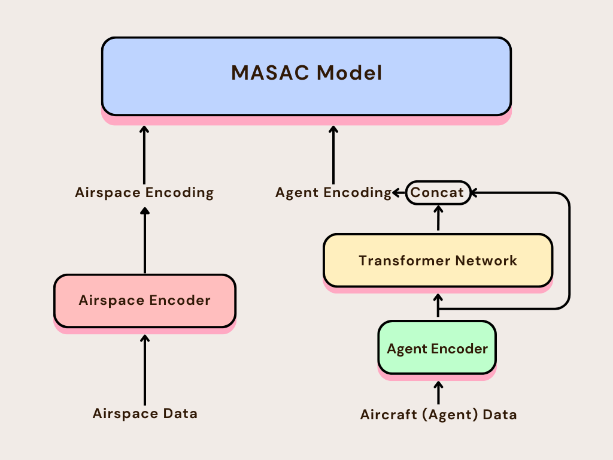

# Data Pipeline Design

The data to fetch from the simulator consist of two parts:  
* the airspace data: airspace range info, airports info, restriction info, simulation info, and conflict info  
* the aircraft data: position, intention etc. of each aircraft  

There will be up to 50 agents (aircrafts) in each scenario.

## `trainappbs.py`

This module is the main module of the simulation manager for training. In this module the following features will be fetched from the simulator.

Some predefined variables:

* import `bluesky` as `bs`,
* set `approach_bs = bs.plugins.approachbs.approach_bs`,
* set `traf = bs.traf`.

### Airspace Data

*simulation data*  
* time in simulator: `simt = bs.sim.simt` (float, seconds)  
* number of aircrafts: `ntraf = traf.ntraf` (int)  
* number of aircrafts in the airspace: `n_in_airspace = approach_bs.under_ctrl.sum()` (int)  
* number of arrival aircrafts: `n_arrival = (approach_bs.intention==0).sum()` (int)  
* number of departure aircrafts: `n_departure = (approach_bs.intention==1).sum()` (int)  

*airspace data*  
* latitude of airspace center: `approach_bs.tracon.ctr_lat` (float, degrees)  
* longitude of airspace center: `approach_bs.tracon.ctr_lon` (float, degrees)  
* range of the airspace: `approach_bs.tracon.range` (float, nautical miles)  
* bottom altitude: `approach_bs.tracon.bottom` (float, feet)
* top altitude: `approach_bs.tracon.top` (float, feet)  
* ground elevation: `approach_bs.tracon.elevation` (float, feet)  

*airports and runways data*  
* airports: `approach_bs.tracon.apt` (dictionary)  
The keys are the airport IDs, and the values are ndarrays [lat, lon, elev]. There are up to 5 airports in the airspace.  

*restrictions*
* restricted areas: `approach_bs.tracon.restrict` (dictionary)  
The keys are the ID of the restricted area, and the values are ndarrays of length 6 to 19, depending on the shape of the restricted area. See `approachbs.py` -> `Tracon.add_restricted` for more details. There are up to 20 restricted areas in the airspace.  

### Aircraft Data

*BlueSky dynamics data*
* ID: `traf.id` (list of length ntraf, strings)  
* type: `traf.type` (list oflength ntraf, strings)  
* latitude: `traf.lat` (ndarray of shape (ntraf,), float, degrees)  
* longitude: `traf.lon` (ndarray of shape (ntraf,), float, degrees)  
* track: `traf.trk` (ndarray of shape (ntraf,), float, degrees)  
* altitude: `traf.alt` (ndarray of shape (ntraf,), float, **meters**)
* cas: `traf.cas` (ndarray of shape (ntraf,), float, **m/s**)

*BlueSky navigation status data*
* LNAV: `traf.swlnav` (ndarray of shape (ntraf,), bool)
* Selected track: `traf.aporasas.trk` (ndarray of shape (ntraf,), float, degrees)
* Selected altitude: `traf.selalt` (ndarray of shape (ntraf,), float, **meters**)
* Selected cas: `traf.selspd` (ndarray of shape (ntraf,), float, **m/s**)

*ApproachBS data*
* assigned waypoint ID: `approach_bs.wp_id` (list of length ntraf, strings)  
* in airspace: `approach_bs.under_ctrl` (ndarray of shape (ntraf,), bool)  
* radar vector or self navigation: `approach_bs.radar_vector` (ndarray of shape (ntraf,), bool)  
* intention: `approach_bs.intention` (ndarray of shape (ntraf,), int)  
* assigned waypoint latitude: `approach_bs.wp_lat` (ndarray of shape (ntraf,), float, degrees)  
* assigned waypoint longitude: `approach_bs.wp_lon` (ndarray of shape (ntraf,), float, degrees)  
* assigned waypoint altitude: `approach_bs.wp_alt` (ndarray of shape (ntraf,), float, feet)  
* assigned runway course: `approach_bs.rwy_course` (ndarray of shape (ntraf,), float, degrees)  
* distance to assigned waypoint: `approach_bs.dist_to_wp` (ndarray of shape (ntraf,), float, nautical miles)  
* bearing to assigned waypoint: `approach_bs.bearing_to_wp` (ndarray of shape (ntraf,), float, degrees)  
* time when entering the airspace: `approach_bs.time_entered` (ndarray of shape (ntraf,), float, seconds)  
* time when received the last command: `approach_bs.time_last_cmd` (ndarray of shape (ntraf,), float, seconds)  
* whether the aircraft is taken over by ATC: `approach_bs.take_over` (ndarray of shape (ntraf,), bool)  
* whether the aircraft is out of the deletion range: `approach_bs.out_of_range` (ndarray of shape (ntraf,), bool)  

*Conflict and invasion data*
* loss of separation pairs: `approach_bs.conflict_detector.lospairs_unique` (set of frozen sets)  
* whether the aircraft is in loss of separation: `approach_bs.conflict_detector.inlos` (ndarray of shape (ntraf,), bool)  
* conflict in one minute pairs: `approach_bs.conflict_detector.conf_one_minute_unique` (set of frozen sets)  
* whether the aircraft is in conflict in one minute: `approach_bs.conflict_detector.inconf_one_minute` (ndarray of shape (ntraf,), bool)  
* conflict in three minutes pairs: `approach_bs.conflict_detector.conf_three_minute_unique` (set of frozen sets)  
* whether the aircraft is in conflict in three minutes: `approach_bs.conflict_detector.inconf_three_minute` (ndarray of shape (ntraf,), bool)  
* current invasion: `approach_bs.invasion_detector.current_invasion` (dictionary mapping restricted area IDs to lists of aircraft IDs)  
* whether the aircraft is invading: `approach_bs.invasion_detector.acf_invasion_flag` (ndarray of shape (ntraf,), bool)  
* invasion in one minute: `approach_bs.invasion_detector.one_minute_invasion` (dictionary mapping restricted area IDs to lists of aircraft IDs)  
* whether the aircraft is invading in one minute: `approach_bs.invasion_detector.acf_invasion_flag_one_minute` (ndarray of shape (ntraf,), bool)  
* invasion in three minutes: `approach_bs.invasion_detector.three_minute_invasion` (dictionary mapping restricted area IDs to lists of aircraft IDs)  
* whether the aircraft is invading in three minutes: `approach_bs.invasion_detector.acf_invasion_flag_three_minute` (ndarray of shape (ntraf,), bool)  

